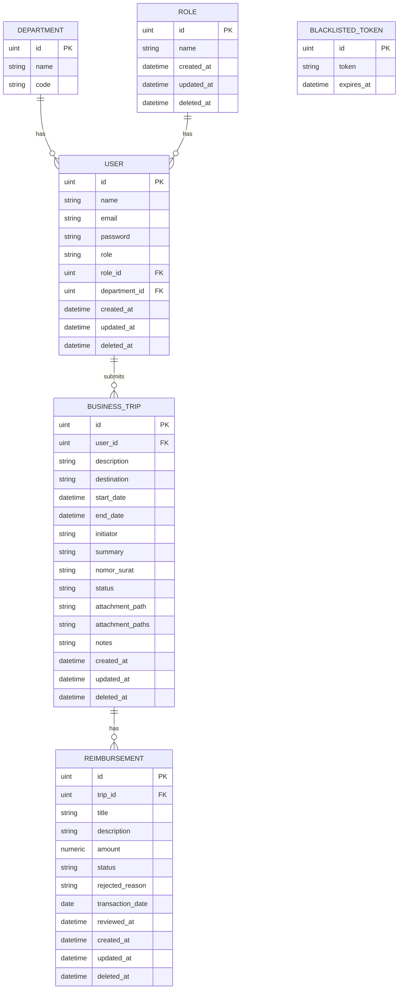

# ERD Diagram - Travel Dinas System

## Keterangan Hubungan Antar Tabel (Relasi)
1. **DEPARTMENT & USER**: Satu departemen dapat menaungi banyak user (`1 to many`). Kolom `department_id` di tabel `USER` bertindak sebagai Foreign Key ke tabel `DEPARTMENT`.
2. **ROLE & USER**: Satu role dapat dimiliki oleh banyak user (`1 to many`). Kolom `role_id` di tabel `USER` bertindak sebagai Foreign Key ke tabel `ROLE`.
3. **USER & BUSINESS_TRIP**: Satu user dapat mengajukan banyak perjalanan dinas (`1 to many`). Kolom `user_id` di tabel `BUSINESS_TRIP` bertindak sebagai Foreign Key ke tabel `USER`.
4. **BUSINESS_TRIP & REIMBURSEMENT**: Satu perjalanan dinas dapat memiliki banyak klaim reimbursement/pengeluaran (`1 to many`). Kolom `trip_id` di tabel `REIMBURSEMENT` bertindak sebagai Foreign Key ke tabel `BUSINESS_TRIP`.
5. **BLACKLISTED_TOKEN**: Tabel independen sistem yang digunakan untuk menyimpan daftar token JWT yang tidak valid setelah user melakukan logout (proses blacklist token) demi keamanan sesi.
