# Use Case Diagram - Travel Dinas System

```mermaid
flowchart TD
    A[Employee] --> UC1[Login / Logout]
    A --> UC2[Submit Travel Request]
    A --> UC3[Upload Supporting Documents - PDF/JPG/PNG]
    A --> UC4[Submit Reimbursement Claim]
    A --> UC5[View My Trips]
    A --> UC6[View Employee Dashboard]
    A --> UC7[Update Travel Request]
    A --> UC8[Update Trip Claim & Notes]
    A --> UC9[Download Attachments]
    A --> UC10[View Claims of a Trip]

    B[Manager] --> UC11[View Manager Dashboard]
    B --> UC12[View Incoming Applications]
    B --> UC13[View Team Distribution]
    B --> UC14[Review & Update Trip Status]
    B --> UC15[View Department/All Trips]
    B --> UC16[Download Attachment]

    C[Financial Admin - ADMIN_FIN] --> UC17[View All Trips]
    C --> UC18[Review Trip Financial Data]
    C --> UC19[Review Expense Claims]
    C --> UC20[Approve / Reject Claims]
    C --> UC21[Disburse Funds]
    C --> UC22[Download Attachments]

    D[Super Admin] --> UC23[Manage Users - CRUD / Register]
    D --> UC24[Manage Departments - CRUD]
    D --> UC25[Manage Roles & Permissions - CRUD]
    D --> UC26[Monitor All Trips]
    D --> UC27[View All Dashboards]

    UC2 --> UC3
    UC2 --> UC4
    UC14 --> UC8
    UC18 --> UC21
    UC19 --> UC20
```

## Deskripsi Fitur Per Role

### Employee (Karyawan)
- **Login / Logout**: Autentikasi JWT dan logout dengan memasukkan token ke blacklist.
- **Submit Travel Request**: Mengajukan permohonan perjalanan dinas (tujuan, tanggal mulai/selesai, deskripsi, nomor surat, inisiator, ringkasan).
- **Upload Documents**: Mengunggah dokumen pendukung (PDF, JPG, JPEG, PNG) bersamaan dengan pengajuan perjalanan dinas.
- **Update Travel Request**: Mengubah informasi perjalanan dinas yang diajukan sebelum diproses lebih lanjut.
- **Update Trip Claim & Notes**: Memperbarui informasi lampiran atau catatan tambahan pasca-perjalanan.
- **Submit Reimbursement Claim**: Mengajukan klaim reimbursement terkait perjalanan dinas dengan nominal, judul, deskripsi, tanggal transaksi, dan bukti file.
- **View My Trips**: Melihat daftar dan detail riwayat perjalanan dinas milik pribadi secara paginated.
- **View Claims of a Trip**: Melihat detail klaim/reimbursement yang diajukan untuk perjalanan tertentu.
- **Employee Dashboard**: Dashboard ringkasan perjalanan dinas pribadi (pending, approved, completed, dll.).
- **Download Attachments**: Mengunduh lampiran surat perjalanan dinas atau bukti reimbursement sendiri.

### Manager (Manajer/Supervisor)
- **Manager Dashboard**: Statistik pengajuan tim, approval rate, dan ringkasan status perjalanan departemen yang dipimpin.
- **View Incoming Applications**: Melihat daftar pengajuan perjalanan dinas dari anggota tim di bawah departemennya yang membutuhkan persetujuan.
- **Team Distribution**: Melihat data distribusi perjalanan dinas per anggota tim secara visual/statistikal.
- **Review & Update Trip Status**: Menolak, menyetujui, atau mengubah status perjalanan dinas (`APPROVED`, `REJECTED`, `ON_DUTY`, `COMPLETED`).
- **View Department/All Trips**: Melihat dan memonitor semua data perjalanan dinas di dalam departemennya.
- **Download Attachment**: Mengunduh lampiran pengajuan untuk proses verifikasi persetujuan.

### Financial Admin (Admin Keuangan / `ADMIN_FIN`)
- **View All Trips**: Melihat data monitoring perjalanan dinas seluruh karyawan di sistem.
- **Review Trip Financial Data**: Meninjau aspek keuangan perjalanan dinas dan memberikan ulasan/catatan finansial (`ReviewFinancial`).
- **Review Expense Claims**: Melihat klaim reimbursement yang diajukan karyawan secara terperinci.
- **Approve / Reject Claims**: Menyetujui atau menolak pengajuan klaim/reimbursement (`ReviewClaim`) dengan memberikan alasan penolakan jika ditolak.
- **Disburse Funds**: Melakukan pencairan dana/pembayaran perjalanan dinas (`DisburseFunds`) dengan menginput nominal yang dicairkan, ID referensi pembayaran, serta catatan.
- **Download Attachments**: Mengunduh file lampiran perjalanan maupun file bukti reimbursement karyawan untuk verifikasi keuangan.

### Super Admin (Administrator Sistem)
- **Manage Users (CRUD)**: Mengelola data pengguna, termasuk mendaftarkan akun baru (Register), memperbarui data, melihat detail, dan menghapus pengguna.
- **Manage Departments (CRUD)**: Mengelola data departemen perusahaan (tambah, lihat, ubah, hapus).
- **Manage Roles (CRUD)**: Mengelola role pengguna (tambah, lihat, ubah, hapus).
- **Monitor All Trips**: Memantau seluruh perjalanan dinas di semua departemen secara komprehensif.
- **View All Dashboards**: Mengakses dashboard karyawan, manager, dan sistem secara keseluruhan.
- **Manage Authentication Access**: Mengatur dan mengamankan otorisasi sistem berbasis RBAC (Role-Based Access Control) dan validasi token JWT.

## Alur Utama Workflow
1. **Super Admin** membuat data department, role, dan mendaftarkan user (**Register**).
2. **Employee** masuk ke sistem (**Login**) lalu mengajukan perjalanan dinas (**Submit Travel Request**) dengan mengunggah dokumen pendukung.
3. **Manager** meninjau pengajuan perjalanan dinas karyawan di departemennya lalu memberikan keputusan status (**Review & Update Trip Status**).
4. **Employee** yang melakukan perjalanan dinas dapat mengajukan reimbursement (**Submit Reimbursement Claim**) dengan menyertakan bukti pembayaran.
5. **Financial Admin** melakukan ulasan finansial, menyetujui/menolak reimbursement (**Approve / Reject Claims**), dan melakukan pencairan dana perjalanan (**Disburse Funds**).
6. **Employee / Manager / Financial Admin / Super Admin** dapat keluar dari sesi (**Logout**) untuk mengamankan akun.

## Fitur Keamanan dan Validasi
- **JWT Bearer Token**: Autentikasi API yang aman di setiap request.
- **Token Blacklisting**: Menambahkan token JWT ke blacklist database saat logout untuk mencegah penggunaan kembali token lama.
- **Role-Based Access Control (RBAC)**: Pembatasan akses endpoint yang ketat berdasarkan role (`SUPER_ADMIN`, `EMPLOYEE`, `MANAGER`, `ADMIN_FIN`, `ADMIN_HR`, `ADMIN_IT`).
- **File Validation & MinIO Storage**: Pembatasan upload file (PDF, JPG, JPEG, PNG) serta validasi ukuran dokumen. Berkas disimpan secara terpusat di server MinIO S3 dengan fallback otomatis ke disk lokal jika koneksi MinIO tidak tersedia (terutama untuk kelancaran testing).
- **CORS Config**: Mengizinkan frontend melakukan request API secara aman dari origin yang ditentukan.

